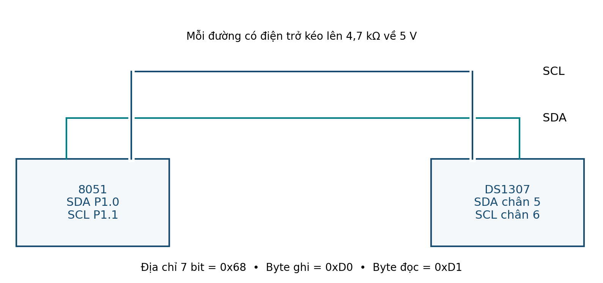

# Mở rộng — RTC DS1307

## Kết nối
| DS1307 | Kết nối |
|---|---|
| X1/X2 | Crystal 32.768 kHz |
| VBAT | Pin dự phòng phù hợp |
| GND | Ground |
| SDA | P1.0 + pull-up 4.7 kΩ |
| SCL | P1.1 + pull-up 4.7 kΩ |
| VCC | 5 V |
| SQW/OUT | Để hở nếu không dùng |

<figure class="hct-figure">
  <a href="../../../../../assets/images/microcontroller/extensions/ext-ds1307-i2c.png" target="_blank" rel="noopener">
    
  </a>
  <figcaption>Kết nối I²C cho DS1307.</figcaption>
</figure>

<figure class="hct-figure">
  <a href="../../../../../assets/images/microcontroller/theory/fig25-i2c-pullups.png" target="_blank" rel="noopener">
    
  </a>
  <figcaption>Hai đường I²C có điện trở kéo lên riêng.</figcaption>
</figure>

## Quy trình
1. Kiểm tra nguồn và pin dự phòng.
2. Dựng I²C, xác nhận bus nghỉ cao.
3. Project: `main.c`, `common.h`, `uart.h`.
4. Lần đầu `SET_TIME=1`, đặt 12:00:00, 24 h, CH=0.
5. Sau đó `SET_TIME=0`, build/nạp lại.
6. Quan sát giây tăng, kiểm tra BCD.
7. Mất nguồn logic rồi cấp lại, kiểm tra backup.

## Ca thử
- Địa chỉ 7 bit `0x68`.
- Địa chỉ sai → lỗi.
- CH=0.
- 12:59:59 → 13:00:00.
- Quan sát ACK/NACK.

!!! question
    Tại sao byte write là `0xD0` nhưng địa chỉ 7 bit là `0x68`?


## Code minh họa bổ sung

<div class="hct-code-actions">

[💻 Xem project trên GitHub](https://github.com/Huynhcongtu/hct-learning-hub/tree/main/code/extensions/X02_DS1307){ .md-button .md-button--primary }
[⬇️ Mở main.c](https://raw.githubusercontent.com/Huynhcongtu/hct-learning-hub/main/code/extensions/X02_DS1307/main.c){ .md-button }

</div>

```c
#include "common.h"
#include "uart.h"

PIN(SDA,P1,0);
PIN(SCL,P1,1);

#define DS1307_ADDR 0x68u
#define SET_TIME 0

static void i2c_delay(void) {
    NOP(); NOP(); NOP(); NOP();
}

static u8 scl_high(void) {
    u16 guard=5000u;
    SCL=1;
    while(!SCL && --guard) { }
    return SCL ? 1u : 0u;
}

static void i2c_start(void) {
    SDA=1; SCL=1; i2c_delay();
    SDA=0; i2c_delay();
    SCL=0;
}

static void i2c_stop(void) {
    SDA=0; i2c_delay();
    scl_high(); i2c_delay();
    SDA=1; i2c_delay();
}

static u8 i2c_write(u8 x) {
    u8 i,ack;

    for(i=0;i<8u;i++) {
        SDA=(x & 0x80u) ? 1 : 0;
        i2c_delay();
        if(!scl_high()) return 0;
        i2c_delay();
        SCL=0;
        x<<=1;
    }

    SDA=1;
    i2c_delay();
    if(!scl_high()) return 0;
    ack=(SDA==0);
    SCL=0;
    return ack;
}

static u8 i2c_read(u8 ack) {
    u8 i,x=0;

    SDA=1;
    for(i=0;i<8u;i++) {
        x<<=1;
        if(!scl_high()) return 0;
        if(SDA) x|=1u;
        SCL=0;
    }

    SDA=ack ? 0 : 1;
    i2c_delay();
    scl_high();
    SCL=0;
    SDA=1;

    return x;
}

static u8 ds1307_write_reg(u8 reg,u8 value) {
    i2c_start();
    if(!i2c_write((u8)(DS1307_ADDR<<1))) { i2c_stop(); return 0; }
    if(!i2c_write(reg))                  { i2c_stop(); return 0; }
    if(!i2c_write(value))                { i2c_stop(); return 0; }
    i2c_stop();
    return 1;
}

static u8 ds1307_read_hms(u8 *hh,u8 *mm,u8 *ss) {
    i2c_start();
    if(!i2c_write((u8)(DS1307_ADDR<<1))) { i2c_stop(); return 0; }
    if(!i2c_write(0x00u))                { i2c_stop(); return 0; }

    i2c_start();
    if(!i2c_write((u8)((DS1307_ADDR<<1)|1u))) { i2c_stop(); return 0; }

    *ss=i2c_read(1);
    *mm=i2c_read(1);
    *hh=i2c_read(0);
    i2c_stop();

    if((*ss & 0x80u)!=0u) return 0; /* CH must be 0 */
    if((*hh & 0x40u)!=0u) return 0; /* sample expects 24-hour mode */

    return 1;
}

void main(void) {
    u8 hh,mm,ss;

    EA=0;
    SDA=1; SCL=1;
    uart_init();
    uart_puts("DS1307 READY\r\n");

#if SET_TIME
    ds1307_write_reg(0x00u,0x00u);
    ds1307_write_reg(0x01u,0x00u);
    ds1307_write_reg(0x02u,0x12u);
#endif

    for(;;) {
        if(ds1307_read_hms(&hh,&mm,&ss)) {
            uart_hex(hh); uart_putc(':');
            uart_hex(mm); uart_putc(':');
            uart_hex(ss); uart_puts("\r\n");
        } else {
            uart_puts("RTC ERROR\r\n");
        }

        /* Deliberately simple teaching loop; not a calibrated 1 s scheduler. */
        {
            u16 wait=60000u;
            while(--wait) { NOP(); }
        }
    }
}
```

!!! info
    Đây là **SUPPLEMENTAL implementation** được viết theo yêu cầu của bài mở rộng/project trong học liệu.
    Tài liệu nguồn không cung cấp nguyên văn chương trình đầy đủ này.

