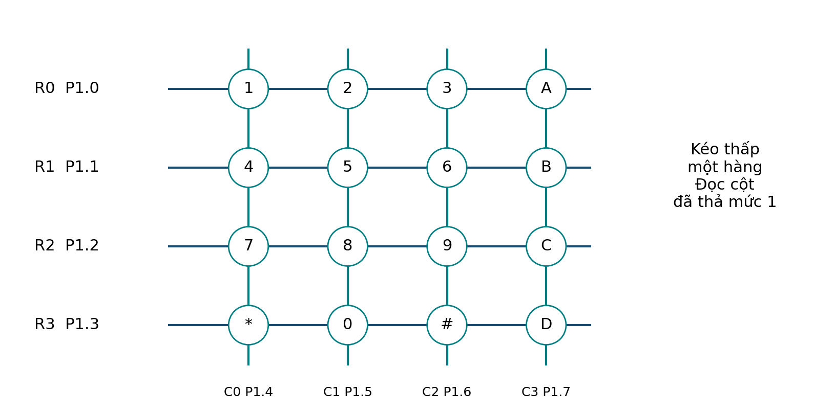

# Mở rộng — Keypad 4×4

## Kết nối
- R0–R3 → P1.0–P1.3.
- C0–C3 → P1.4–P1.7.
- Cột kéo lên 10 kΩ.
- P3.1 TXD → RX terminal 9600 8N1.
- GND chung.

<figure class="hct-figure">
  
  <figcaption>Ánh xạ hàng/cột của bài mở rộng keypad 4×4.</figcaption>
</figure>

<figure class="hct-figure">
  
  <figcaption>Cách quét bàn phím bốn hàng bốn cột.</figcaption>
</figure>

## Quy trình
1. Xác định hàng/cột bằng sơ đồ hoặc continuity test.
2. Dựng ma trận, đánh dấu 16 phím.
3. Project dùng `main.c`, `common.h`, `delay.h`, `uart.h`.
4. Nhấn từng phím và kiểm tra terminal.
5. Giữ phím 3 s → không tự lặp.
6. Thử hai phím → ghi giới hạn ghosting.
7. Đổi bảng ký tự mà giữ nguyên driver.

## Sản phẩm
Bảng ký tự đúng/sai, ảnh đấu dây, UART log và giải thích `0xFF` biểu diễn không có phím hợp lệ.
