# Thư viện hình minh họa

Các hình dưới đây được trích trực tiếp từ **Giáo trình Kỹ thuật vi điều khiển** và **Hướng dẫn thực hành Kỹ thuật vi điều khiển** của bộ học liệu nguồn.

!!! tip "Phóng to"
    Bấm vào hình để mở ảnh nguyên bản ở tab mới.

## Hình lý thuyết

<figure class="hct-figure">
  
  <figcaption>Hình 1. Hệ thống điều khiển gồm cảm biến, bộ xử lý và cơ cấu chấp hành.</figcaption>
</figure>

<figure class="hct-figure">
  
  <figcaption>Hình 2. Trọng số của tám bit trong byte A5H.</figcaption>
</figure>

<figure class="hct-figure">
  
  <figcaption>Hình 3. Các khối chức năng chính của kiến trúc 8051.</figcaption>
</figure>

<figure class="hct-figure">
  
  <figcaption>Hình 4. Sơ đồ chân AT89S52 PDIP 40 nhìn từ trên.</figcaption>
</figure>

<figure class="hct-figure">
  
  <figcaption>Hình 5. Kết nối tối thiểu cho mạch thực hành AT89S52.</figcaption>
</figure>

<figure class="hct-figure">
  
  <figcaption>Hình 6. Cách phân biệt CODE, RAM và SFR trên AT89S52.</figcaption>
</figure>

<figure class="hct-figure">
  <a href="../../../../assets/images/microcontroller/theory/fig07-build-sim-program-flow.png" target="_blank" rel="noopener">
    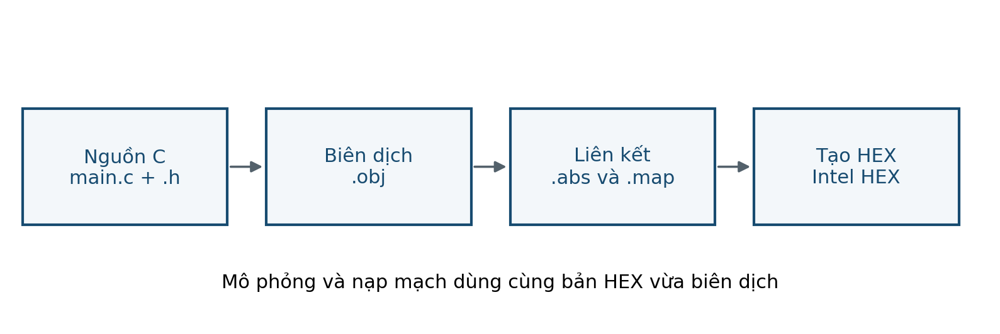
  </a>
  <figcaption>Hình 7. Chuỗi tạo chương trình để mô phỏng và nạp.</figcaption>
</figure>

<figure class="hct-figure">
  
  <figcaption>Hình 8. Chỉ công nhận trạng thái sau khi tín hiệu ổn định đủ thời gian.</figcaption>
</figure>

<figure class="hct-figure">
  <a href="../../../../assets/images/microcontroller/theory/fig09-finite-state-machine.png" target="_blank" rel="noopener">
    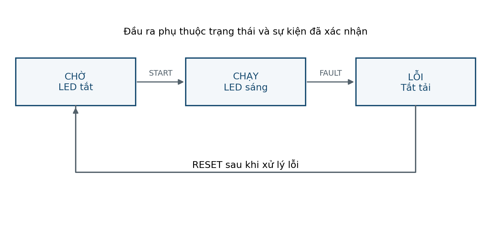
  </a>
  <figcaption>Hình 9. Mô hình trạng thái cho thiết bị điều khiển đơn giản.</figcaption>
</figure>

<figure class="hct-figure">
  
  <figcaption>Hình 10. Timer bắt đầu từ FC66H và tràn sau 922 lần đếm.</figcaption>
</figure>

<figure class="hct-figure">
  
  <figcaption>Hình 11. CPU phục vụ ISR rồi quay lại chương trình chính.</figcaption>
</figure>

<figure class="hct-figure">
  
  <figcaption>Hình 12. Khung UART 8N1 của byte A5H.</figcaption>
</figure>

<figure class="hct-figure">
  
  <figcaption>Hình 13. Tên các đoạn và bảng mã anode chung của cấu hình mẫu.</figcaption>
</figure>

<figure class="hct-figure">
  
  <figcaption>Hình 14. Quét bốn digit và dành khoảng tắt khi thay mã đoạn.</figcaption>
</figure>

<figure class="hct-figure">
  <a href="../../../../assets/images/microcontroller/theory/fig15-lcd1602-4bit.png" target="_blank" rel="noopener">
    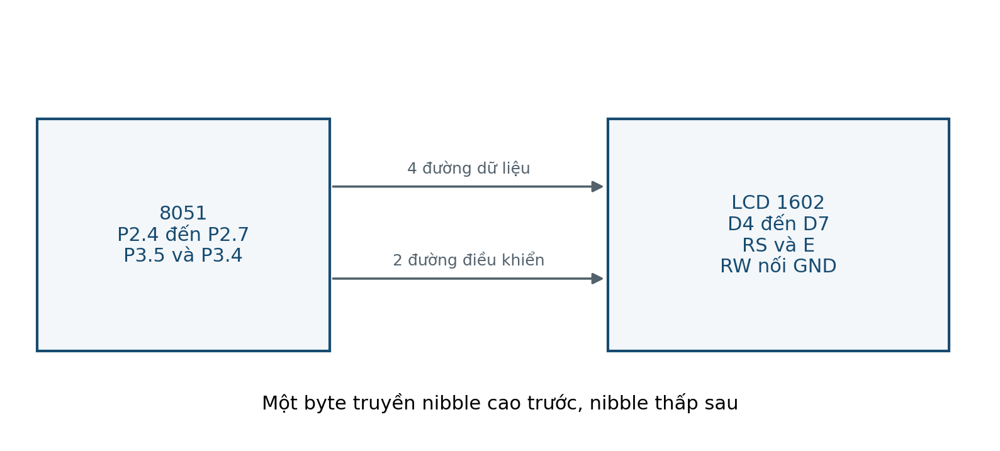
  </a>
  <figcaption>Hình 15. Giao tiếp LCD 1602 ở chế độ bốn bit.</figcaption>
</figure>

<figure class="hct-figure">
  
  <figcaption>Hình 16. Cách quét bàn phím bốn hàng bốn cột.</figcaption>
</figure>

<figure class="hct-figure">
  
  <figcaption>Hình 17. Biểu diễn một ký tự bằng tám hàng tám cột.</figcaption>
</figure>

<figure class="hct-figure">
  <a href="../../../../assets/images/microcontroller/theory/fig18-adc-quantization.png" target="_blank" rel="noopener">
    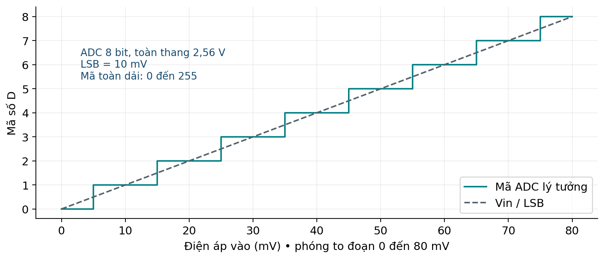
  </a>
  <figcaption>Hình 18. Lượng tử hóa điện áp thành các mức số.</figcaption>
</figure>

<figure class="hct-figure">
  <a href="../../../../assets/images/microcontroller/theory/fig19-lm35-adc0804-lcd.png" target="_blank" rel="noopener">
    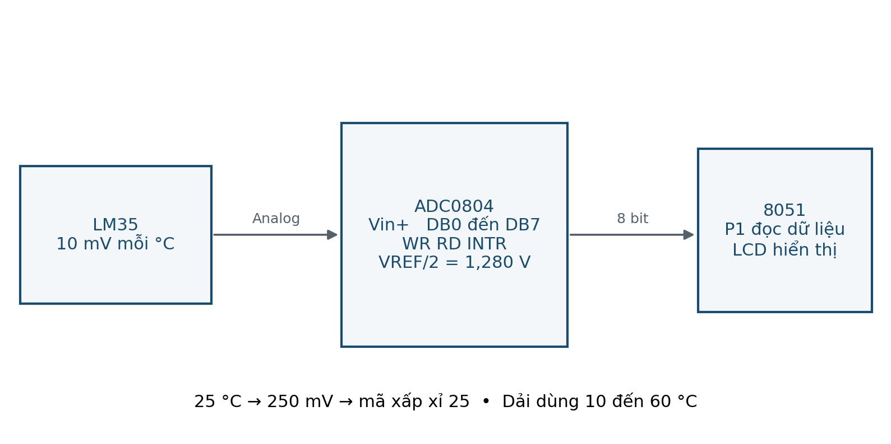
  </a>
  <figcaption>Hình 19. Chuỗi đo nhiệt độ với LM35, ADC0804 và LCD.</figcaption>
</figure>

<figure class="hct-figure">
  
  <figcaption>Hình 20. DAC0808 cần tầng chuyển dòng sang điện áp.</figcaption>
</figure>

<figure class="hct-figure">
  <a href="../../../../assets/images/microcontroller/theory/fig21-pwm-duty-cycle.png" target="_blank" rel="noopener">
    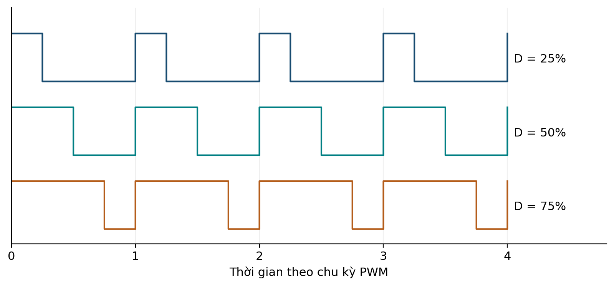
  </a>
  <figcaption>Hình 21. Cùng chu kỳ nhưng duty khác nhau tạo mức tác động trung bình khác nhau.</figcaption>
</figure>

<figure class="hct-figure">
  <a href="../../../../assets/images/microcontroller/theory/fig22-reset-safe-power-stage.png" target="_blank" rel="noopener">
    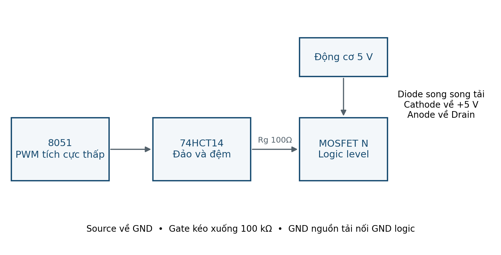
  </a>
  <figcaption>Hình 22. Tầng công suất có trạng thái tắt khi MCU reset.</figcaption>
</figure>

<figure class="hct-figure">
  <a href="../../../../assets/images/microcontroller/theory/fig23-quadrature-encoder.png" target="_blank" rel="noopener">
    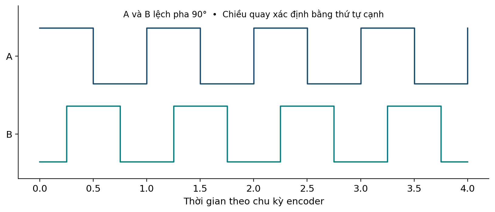
  </a>
  <figcaption>Hình 23. Hai kênh A và B của encoder tăng dần.</figcaption>
</figure>

<figure class="hct-figure">
  
  <figcaption>Hình 24. Bộ thu hồng ngoại tách sóng mang trước khi MCU giải mã.</figcaption>
</figure>

<figure class="hct-figure">
  
  <figcaption>Hình 25. Hai đường I²C có điện trở kéo lên riêng.</figcaption>
</figure>

<figure class="hct-figure">
  <a href="../../../../assets/images/microcontroller/theory/fig26-external-sram-address-latch.png" target="_blank" rel="noopener">
    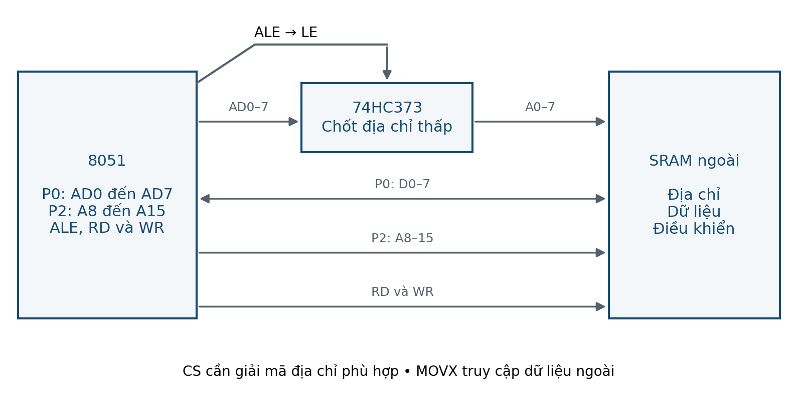
  </a>
  <figcaption>Hình 26. Tách địa chỉ thấp khỏi bus P0 khi ghép SRAM ngoài.</figcaption>
</figure>

<figure class="hct-figure">
  <a href="../../../../assets/images/microcontroller/theory/fig27-measurement-debug-flow.png" target="_blank" rel="noopener">
    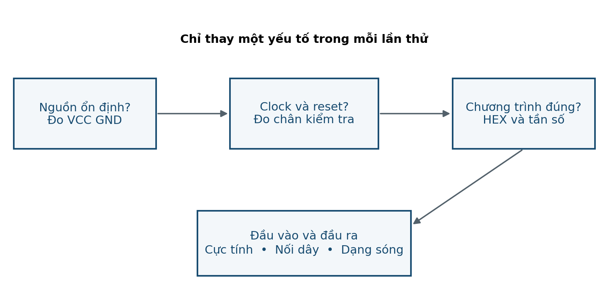
  </a>
  <figcaption>Hình 27. Trình tự khoanh vùng lỗi dựa trên phép đo.</figcaption>
</figure>

<figure class="hct-figure">
  
  <figcaption>Hình 28. Hai ngưỡng khác nhau ngăn đầu ra đổi liên tục quanh một mức nhiệt.</figcaption>
</figure>

## Sơ đồ thực hành và mở rộng

<figure class="hct-figure">
  
  <figcaption>Lab 01 — Mạch tối thiểu và chớp LED.</figcaption>
</figure>

<figure class="hct-figure">
  <a href="../../../../assets/images/microcontroller/labs/lab02-button-debounce.png" target="_blank" rel="noopener">
    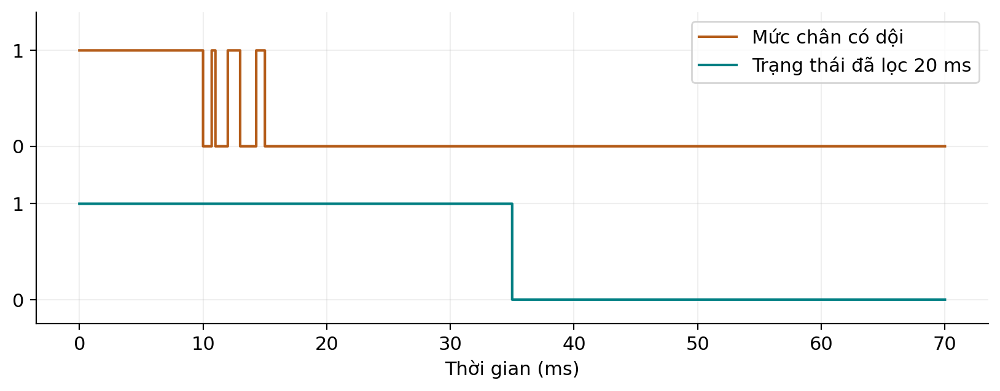
  </a>
  <figcaption>Lab 02 — Nút nhấn và LED.</figcaption>
</figure>

<figure class="hct-figure">
  
  <figcaption>Lab 03 — Quét bốn LED 7 đoạn.</figcaption>
</figure>

<figure class="hct-figure">
  
  <figcaption>Lab 04 — LCD 1602 chế độ 4 bit.</figcaption>
</figure>

<figure class="hct-figure">
  
  <figcaption>Lab 05 — LED matrix 8×8.</figcaption>
</figure>

<figure class="hct-figure">
  
  <figcaption>Lab 08 — PWM và tải điện áp thấp.</figcaption>
</figure>

<figure class="hct-figure">
  
  <figcaption>Lab 09 — Điều khiển hồng ngoại NEC.</figcaption>
</figure>

<figure class="hct-figure">
  <a href="../../../../assets/images/microcontroller/labs/lab10-uart-pc.png" target="_blank" rel="noopener">
    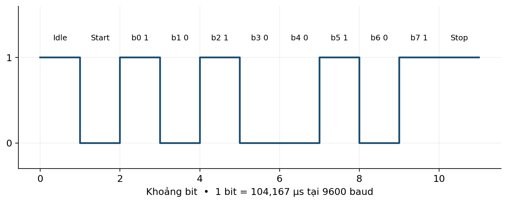
  </a>
  <figcaption>Lab 10 — UART với máy tính.</figcaption>
</figure>

<figure class="hct-figure">
  
  <figcaption>Mở rộng — Keypad 4×4.</figcaption>
</figure>

<figure class="hct-figure">
  
  <figcaption>Mở rộng — DS1307 qua I²C.</figcaption>
</figure>

<figure class="hct-figure">
  <a href="../../../../assets/images/microcontroller/extensions/project-thermostat-hysteresis.png" target="_blank" rel="noopener">
    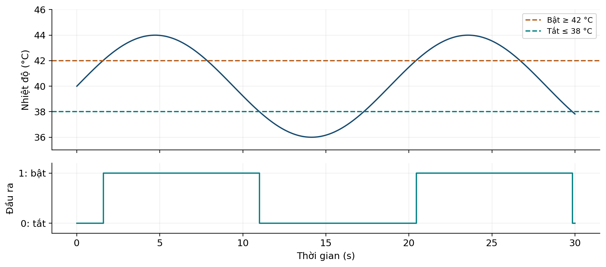
  </a>
  <figcaption>Project — Ca thử thermostat hysteresis.</figcaption>
</figure>

