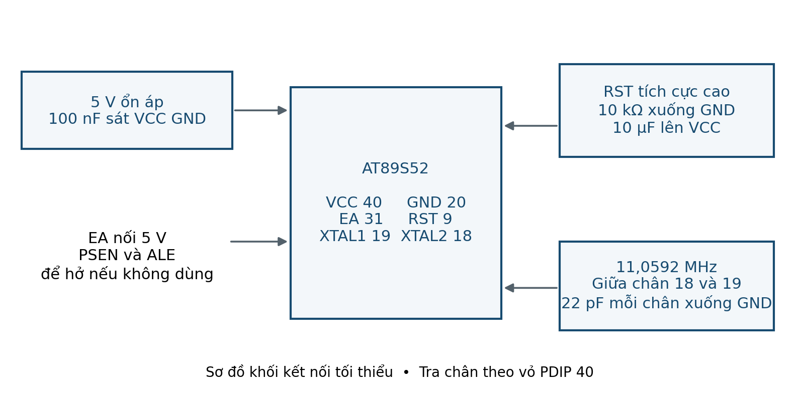
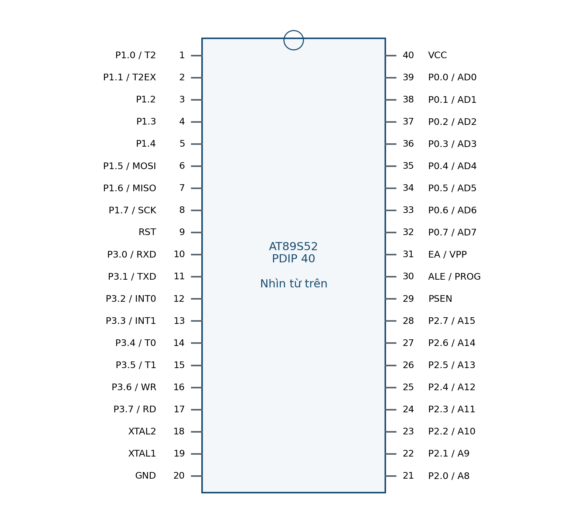

# LAB 01 — Làm quen công cụ & chớp LED

**Đọc trước:** Giáo trình trang **8–12 và 20–21**

<small>Platform</small><strong>AT89S52 · 5 V</strong>

<small>Clock</small><strong>11.0592 MHz · 12T</strong>

<small>Flow</small><strong>Keil → Proteus → KIT → Measure</strong>

## Mục tiêu

Tạo project C51, dựng mạch tối thiểu, sinh HEX và quan sát cùng hành vi trên Proteus và KIT.

## Kết nối tham chiếu

| Tín hiệu / khối | Kết nối / lưu ý |
|---|---|
| VCC 40, GND 20 | 5 V, mass chung, tụ 100 nF sát chân |
| EA 31 | Nối 5 V để chạy Flash nội |
| XTAL1/2 | 11.0592 MHz; 22 pF mỗi phía xuống GND |
| RST 9 | 10 kΩ xuống GND, 10 µF lên 5 V |
| P1.0 | Cathode LED; anode qua 2.2 kΩ lên 5 V |

!!! warning "Trước khi cấp điện"
    Đối chiếu sơ đồ KIT thực. Kiểm tra VCC/GND, chiều linh kiện, reset, clock, điện trở hạn dòng và jumper.

<figure class="hct-figure">
  
  <figcaption>Minh họa nguyên lý Lab 01 — mạch tối thiểu AT89S52 và điểm cần quan sát.</figcaption>
</figure>

<figure class="hct-figure">
  
  <figcaption>Sơ đồ chân AT89S52 PDIP40 để đối chiếu khi đấu KIT.</figcaption>
</figure>

## Quy trình từng bước

1. Tạo thư mục L01 và project AT89S52; chỉ thêm `main.c` của L01.
2. Xác định LED tích cực thấp; dự đoán mức sáng/tắt trước khi build.
3. Proteus: clock 11.0592 MHz, gán HEX mới.
4. Đo P1.0 với bản 500/500 ms.
5. Đổi 200/800 ms và kiểm tra duty thấp khoảng 20%.
6. Đối chiếu jumper/ánh xạ LED trên KIT.
7. Program + verify với bộ nạp hỗ trợ AT89S52.
8. Nếu lỗi: nguồn → reset → clock → thuật toán.

## Ca kiểm thử

| Ca thử | Kết quả dự kiến |
|---|---|
| 500/500 | Hai mức gần 0.5 s; chu kỳ gần 1 s |
| 200/800 | Sáng ~0.2 s, tắt ~0.8 s |
| Giữ RESET | Không tiếp tục chu kỳ |
| Power cycle | Khởi động lại |

## Lỗi thường gặp

| Dấu hiệu | Hướng kiểm tra |
|---|---|
| LED luôn tắt | Đảo cực / sai pin / HEX cũ |
| KIT không chạy | Nguồn, RST, EA hoặc clock |

## Phân tích sau thực hành

1. Vì sao delay đo được không tuyệt đối bằng tham số ms?
2. Đổi clock trong Keil có làm thạch anh thật đổi không?

## Bằng chứng nộp

- source C + header;
- HEX vừa build;
- project/schematic Proteus;
- bảng ca thử có **số đo thực**;
- waveform/ảnh đo có đơn vị;
- ảnh KIT nếu đã thử;
- mô tả ít nhất một lỗi và cách xử lý.

!!! info
    Nếu mới hoàn thành mô phỏng, phải ghi rõ **“chưa thử KIT”**.
