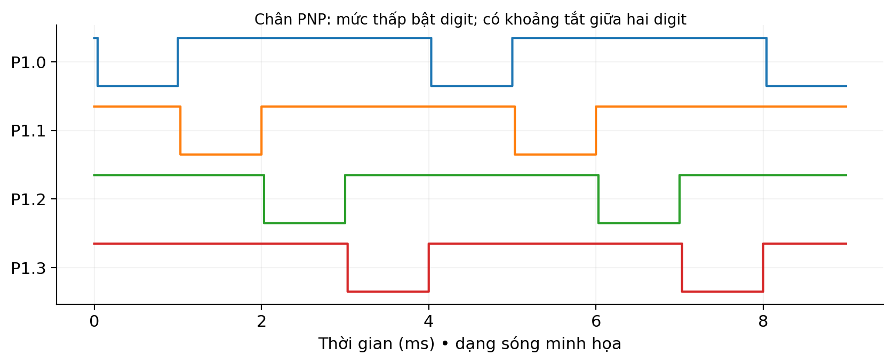

# LAB 03 — Quét bốn LED 7 đoạn

**Đọc trước:** Giáo trình trang **25, 28–29 và 34–35**

<div class="week-meta">
<div><small>Platform</small><strong>AT89S52 · 5 V</strong></div>
<div><small>Clock</small><strong>11.0592 MHz · 12T</strong></div>
<div><small>Flow</small><strong>Keil → Proteus → KIT → Measure</strong></div>
</div>

## Mục tiêu

Hiển thị 0000–9999, kiểm tra bảng mã, multiplexing, dòng tức thời và ghosting.

## Kết nối tham chiếu

| Tín hiệu / khối | Kết nối / lưu ý |
|---|---|
| P2.0–P2.7 | Qua 2.2 kΩ tới a–g,dp |
| P1.0–P1.3 | Điều khiển PNP chọn digit |
| Timer 0 | Dành riêng ISR quét |

!!! warning "Trước khi cấp điện"
    Đối chiếu sơ đồ KIT thực. Kiểm tra VCC/GND, chiều linh kiện, reset, clock, điện trở hạn dòng và jumper.

<figure class="hct-figure">
  <a href="../../../../../assets/images/microcontroller/labs/lab03-four-digit-seven-segment.png" target="_blank" rel="noopener">
    
  </a>
  <figcaption>Minh họa nguyên lý quét bốn LED bảy đoạn.</figcaption>
</figure>

<figure class="hct-figure">
  <a href="../../../../../assets/images/microcontroller/theory/fig14-four-digit-multiplex.png" target="_blank" rel="noopener">
    
  </a>
  <figcaption>Quét bốn digit với khoảng tắt khi thay mã đoạn.</figcaption>
</figure>

## Quy trình từng bước

1. Xác định common-anode và ánh xạ a–g.
2. Thử một digit với 0,1,8.
3. Lắp và thử từng tầng PNP.
4. ISR theo thứ tự tắt digit → segment → bật digit.
5. Đo thời gian digit và frame.
6. Thử biên 9998→9999→0000.
7. Quan sát ghosting khi cố ý đổi sai thứ tự rồi phục hồi.
8. Nạp KIT và kiểm tra dòng segment.

## Ca kiểm thử

| Ca thử | Kết quả dự kiến |
|---|---|
| 0123 | Đúng thứ tự |
| 8888 | Không mất segment |
| 9999+1 | 0000 |
| Digit select | Một digit mỗi thời điểm |
| Frame | Gần 4 ms |

## Lỗi thường gặp

| Dấu hiệu | Hướng kiểm tra |
|---|---|
| Số sai ổn định | Sai display/ánh xạ |
| Ghosting | Đổi segment khi digit cũ còn bật |
| Nhấp nháy | ISR quá chậm/không chạy |

## Phân tích sau thực hành

1. Vì sao main đọc tick nhiều byte cần cẩn thận?
2. Dòng trung bình khác dòng tức thời thế nào?


## Code tham chiếu

<div class="hct-code-actions">

[💻 Xem project trên GitHub](https://github.com/Huynhcongtu/hct-learning-hub/tree/main/code/labs/L03_SevenSegment){ .md-button .md-button--primary }
[⬇️ Mở main.c](https://raw.githubusercontent.com/Huynhcongtu/hct-learning-hub/main/code/labs/L03_SevenSegment/main.c){ .md-button }

</div>

```c
#include "common.h"
u8 ROM seg[10]={0xC0,0xF9,0xA4,0xB0,0x99,0x92,0x82,0xF8,0x80,0x90};
volatile u16 tick=0;
volatile u8 digits[4]={0,0,0,0};
void timer0_isr(void) ISR(1) {
    static u8 pos=0;
    TH0=0xFC; TL0=0x66;
    P1 |= 0x0F;                 /* all PNP digit selectors off */
    P2=seg[digits[pos]];
    P1=(P1 & 0xF0) | (0x0F ^ (1u<<pos));
    pos=(pos+1)&3; ++tick;
}
static u16 now(void) {
    u8 e=EA; u16 t; EA=0; t=tick; EA=e; return t;
}
static void show(u16 n) {
    u8 d[4],e;
    d[0]=n/1000; d[1]=(n/100)%10; d[2]=(n/10)%10; d[3]=n%10;
    e=EA; EA=0;
    digits[0]=d[0]; digits[1]=d[1]; digits[2]=d[2]; digits[3]=d[3];
    EA=e;
}
void main(void) {
    u16 last=0,n=0,t;
    EA=0; P1=0xFF; P2=0xFF; TMOD=(TMOD&0xF0)|1;
    TH0=0xFC; TL0=0x66; TF0=0; ET0=1; EA=1; TR0=1;
    for (;;) {
        t=now();
        if((u16)(t-last)>=500u) {
            last=t; if(++n==10000u)n=0; show(n);
        }
    }
}
```

!!! note "Nguồn"
    Đây là chương trình tham chiếu **SOURCE** từ sổ tay thực hành.
    Các header cần thiết được đặt cùng thư mục project để đúng quy ước mỗi bài là một target riêng.

## Bằng chứng nộp

- source C + header;
- HEX vừa build;
- project/schematic Proteus;
- bảng ca thử có **số đo thực**;
- waveform/ảnh đo có đơn vị;
- ảnh KIT nếu đã thử;
- mô tả ít nhất một lỗi và cách xử lý.

!!! info
    Nếu mới hoàn thành mô phỏng, phải ghi rõ **“chưa thử KIT”**.
