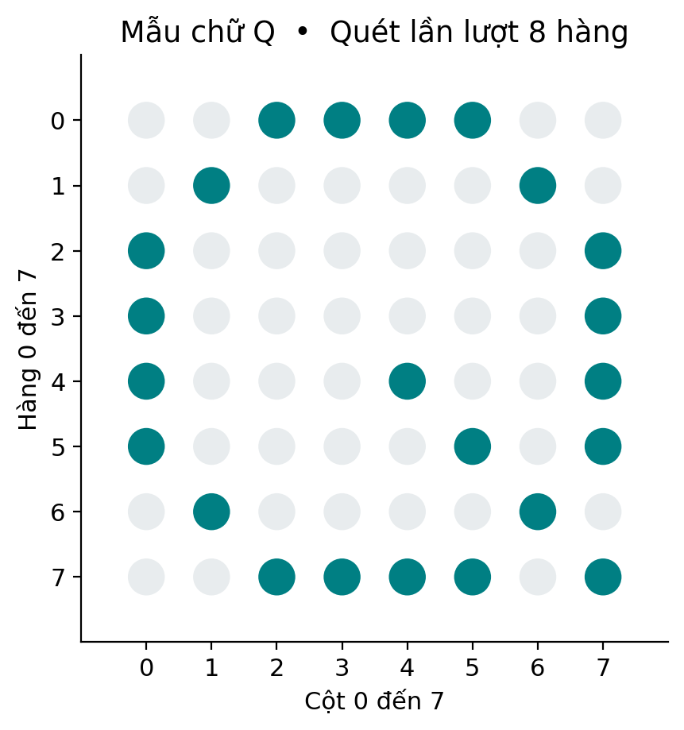

# LAB 05 — LED matrix 8×8

**Đọc trước:** Giáo trình trang **39**

<small>Platform</small><strong>AT89S52 · 5 V</strong>

<small>Clock</small><strong>11.0592 MHz · 12T</strong>

<small>Flow</small><strong>Keil → Proteus → KIT → Measure</strong>

## Mục tiêu

Tạo glyph 8×8, quét hàng bằng timer và kiểm chứng cực tính/giới hạn dòng.

## Kết nối tham chiếu

| Tín hiệu / khối | Kết nối / lưu ý |
|---|---|
| P2.0–P2.7 | Qua 4.7 kΩ tới PNP chọn hàng |
| P1.0–P1.7 | Qua 2.2 kΩ tới cathode cột |
| Glyph bit | Bit 1 = điểm sáng; driver đảo khi xuất |

!!! warning "Trước khi cấp điện"
    Đối chiếu sơ đồ KIT thực. Kiểm tra VCC/GND, chiều linh kiện, reset, clock, điện trở hạn dòng và jumper.

<figure class="hct-figure">
  
  <figcaption>Minh họa nguyên lý LED matrix 8×8.</figcaption>
</figure>

<figure class="hct-figure">
  
  <figcaption>Biểu diễn ký tự bằng tám hàng tám cột.</figcaption>
</figure>

## Quy trình từng bước

1. Vẽ glyph và tính 8 byte.
2. Xác định pin matrix bằng datasheet/diode test.
3. Thử một điểm rồi dịch hàng/cột.
4. Chạy glyph Q; kiểm tra lật.
5. Đo ~1 ms/hàng, frame ~8 ms.
6. Tạo glyph riêng.
7. Kiểm tra dòng khi nhiều điểm sáng.
8. Giải thích tắt hàng→đổi cột→bật hàng.

## Ca kiểm thử

| Ca thử | Kết quả dự kiến |
|---|---|
| Điểm dịch cột | Đúng bit |
| Điểm dịch hàng | Đúng hàng |
| Glyph Q | Đúng hướng |
| Full glyph | Không quá dòng |
| Frame | ~8 ms + overhead |

## Lỗi thường gặp

| Dấu hiệu | Hướng kiểm tra |
|---|---|
| Ảnh lật | Ánh xạ ngược |
| Ghosting | Không tắt hàng |
| Một hàng tối | Pin/PNP/resistor |

## Phân tích sau thực hành

1. Vì sao cần kiểm tra dòng tức thời?
2. Khi ảnh lật nên sửa mapping hay glyph?

## Bằng chứng nộp

- source C + header;
- HEX vừa build;
- project/schematic Proteus;
- bảng ca thử có **số đo thực**;
- waveform/ảnh đo có đơn vị;
- ảnh KIT nếu đã thử;
- mô tả ít nhất một lỗi và cách xử lý.

!!! info
    Nếu mới hoàn thành mô phỏng, phải ghi rõ **“chưa thử KIT”**.
