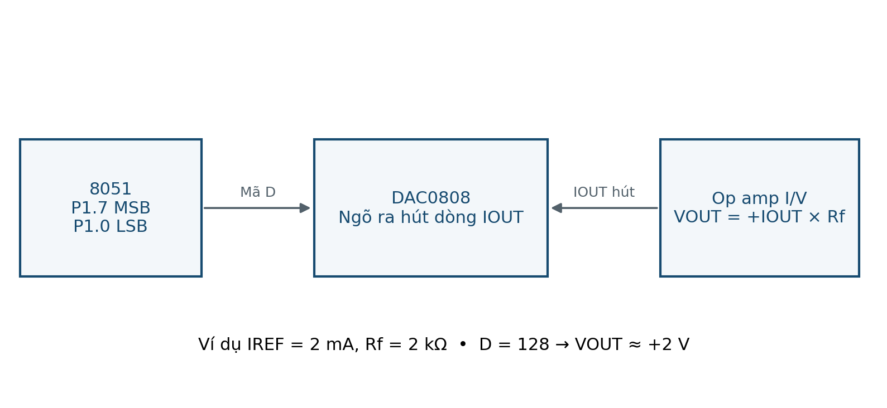

# LAB 07 — DAC0808 & dạng sóng bậc thang

**Đọc trước:** Giáo trình trang **44–45**

<div class="week-meta">
<div><small>Platform</small><strong>AT89S52 · 5 V</strong></div>
<div><small>Clock</small><strong>11.0592 MHz · 12T</strong></div>
<div><small>Flow</small><strong>Keil → Proteus → KIT → Measure</strong></div>
</div>

## Mục tiêu

Tạo 5 mức DAC, kiểm tra tầng I/V và tạo ramp/răng cưa bằng cập nhật mã.

## Kết nối tham chiếu

| Tín hiệu / khối | Kết nối / lưu ý |
|---|---|
| VCC/GND/VEE | +5/GND/−12 V |
| A1–A8 | P1.7–P1.0; A1=MSB |
| REF+ | 2.5 kΩ tới +5 V |
| IOUT | Op-amp I/V |
| Op-amp | Rf=2 kΩ; nguồn ±12 V |

!!! warning "Trước khi cấp điện"
    Đối chiếu sơ đồ KIT thực. Kiểm tra VCC/GND, chiều linh kiện, reset, clock, điện trở hạn dòng và jumper.

<figure class="hct-figure">
  <a href="../../../../../assets/images/microcontroller/theory/fig20-dac0808-current-to-voltage.png" target="_blank" rel="noopener">
    
  </a>
  <figcaption>DAC0808 và tầng chuyển dòng sang điện áp.</figcaption>
</figure>

## Quy trình từng bước

1. Đo nguồn trước khi cắm IC.
2. Kiểm tra IREF gần 2 mA.
3. Dựng tầng I/V.
4. Thử 0,64,128,192,255.
5. Đo VOUT ~0,1,2,3,3.984 V.
6. Chạy ramp 256 mức.
7. Đổi sample delay 1→2 ms.
8. Nộp sơ đồ nguồn + waveform.

## Ca kiểm thử

| Ca thử | Kết quả dự kiến |
|---|---|
| 0 | ~0 V |
| 64/128/192 | ~1/2/3 V |
| 255 | ~3.984 V |
| IOUT node | ~0 V |
| Ramp | 256 mức |

## Lỗi thường gặp

| Dấu hiệu | Hướng kiểm tra |
|---|---|
| Mức sai thứ tự | Đảo MSB/LSB |
| Bão hòa | Nguồn/hồi tiếp |
| Sai dấu | Tầng I/V |

## Phân tích sau thực hành

1. Vì sao 255 không đúng 4 V?
2. Tần số waveform phụ thuộc sample rate/N ra sao?


## Code tham chiếu

<div class="hct-code-actions">

[💻 Xem project trên GitHub](https://github.com/Huynhcongtu/hct-learning-hub/tree/main/code/labs/L07_DAC0808){ .md-button .md-button--primary }
[⬇️ Mở main.c](https://raw.githubusercontent.com/Huynhcongtu/hct-learning-hub/main/code/labs/L07_DAC0808/main.c){ .md-button }

</div>

```c
#include "common.h"
#include "delay.h"
PIN(MODE_KEY,P3,2);
u8 ROM levels[5]={0,64,128,192,255};
void main(void) {
    u8 i=0,d=0; EA=0; P1=0; MODE_KEY=1;
    for (;;) {
        if(MODE_KEY) { P1=levels[i]; delay_ms(1000); if(++i==5)i=0; }
        else { P1=d++; delay_ms(1); }
    }
}
```

!!! note "Nguồn"
    Đây là chương trình tham chiếu **SOURCE** từ sổ tay thực hành.
    Các header cần thiết được đặt cùng thư mục project để đúng quy ước mỗi bài là một target riêng.

## Bằng chứng nộp

- source C + header;
- HEX vừa build;
- project/schematic Proteus;
- bảng ca thử có **số đo thực**;
- waveform/ảnh đo có đơn vị;
- ảnh KIT nếu đã thử;
- mô tả ít nhất một lỗi và cách xử lý.

!!! info
    Nếu mới hoàn thành mô phỏng, phải ghi rõ **“chưa thử KIT”**.
