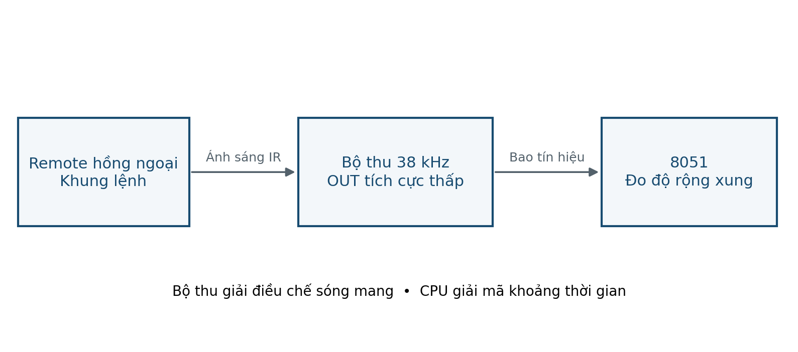

# LAB 09 — Hồng ngoại NEC

**Đọc trước:** Giáo trình trang **49**

<div class="week-meta">
<div><small>Platform</small><strong>AT89S52 · 5 V</strong></div>
<div><small>Clock</small><strong>11.0592 MHz · 12T</strong></div>
<div><small>Flow</small><strong>Keil → Proteus → KIT → Measure</strong></div>
</div>

## Mục tiêu

Đo/giải mã NEC chuẩn, kiểm tra byte bù và phân biệt test logic với test đường quang.

## Kết nối tham chiếu

| Tín hiệu / khối | Kết nối / lưu ý |
|---|---|
| IR OUT | P3.2 active-low |
| P1.0 | LED active-low |
| P3.1 TXD | RX terminal |
| Timer 0 | Đo pulse |
| Timer 1 | Baud 9600 |

!!! warning "Trước khi cấp điện"
    Đối chiếu sơ đồ KIT thực. Kiểm tra VCC/GND, chiều linh kiện, reset, clock, điện trở hạn dòng và jumper.

<figure class="hct-figure">
  <a href="../../../../../assets/images/microcontroller/labs/lab09-nec-ir.png" target="_blank" rel="noopener">
    
  </a>
  <figcaption>Minh họa nguyên lý điều khiển hồng ngoại NEC.</figcaption>
</figure>

<figure class="hct-figure">
  <a href="../../../../../assets/images/microcontroller/theory/fig24-ir-receiver-nec.png" target="_blank" rel="noopener">
    
  </a>
  <figcaption>Bộ thu hồng ngoại tách sóng mang trước khi MCU giải mã.</figcaption>
</figure>

## Quy trình từng bước

1. Tra đúng pin receiver.
2. Terminal 9600 8N1; kiểm tra NEC READY.
3. Mô phỏng có thể dùng pulse logic để test decoder.
4. Đo leader ~9 ms low + ~4.5 ms high.
5. `00 FF 45 BA` → CMD45, LED on.
6. `00 FF 46 B9` → LED off; complement sai phải reject.
7. Dùng remote thật và ghi mã thực.
8. Test repeat/frame cắt.

## Ca kiểm thử

| Ca thử | Kết quả dự kiến |
|---|---|
| 00 FF 45 BA | CMD45/on |
| 00 FF 46 B9 | CMD46/off |
| Complement sai | Reject |
| Repeat | Bỏ qua bản mẫu |
| Frame cắt | Timeout/reject |

## Lỗi thường gặp

| Dấu hiệu | Hướng kiểm tra |
|---|---|
| Không nhận | Protocol/pin/clock |
| Mã khác nhãn | Remote khác |
| Sai ngẫu nhiên | Nguồn/dung sai/polling |

## Phân tích sau thực hành

1. Vì sao pulse test chưa chứng minh cự ly IR?
2. Repeat frame khác full frame thế nào?


## Code tham chiếu

<div class="hct-code-actions">

[💻 Xem project trên GitHub](https://github.com/Huynhcongtu/hct-learning-hub/tree/main/code/labs/L09_IR_NEC){ .md-button .md-button--primary }
[⬇️ Mở main.c](https://raw.githubusercontent.com/Huynhcongtu/hct-learning-hub/main/code/labs/L09_IR_NEC/main.c){ .md-button }

</div>

```c
#include "common.h"
#include "uart.h"
PIN(IR_IN,P3,2); PIN(LED,P1,0);
/* Counts in machine cycles, 11.0592 MHz/12. Standard NEC only.
 * Polling decoder for a dedicated lab. Repeat/extended frames rejected. */
static u16 measure(u8 level) {
    u16 t;
    TR0=0; TH0=0; TL0=0; TF0=0; TR0=1;
    while(IR_IN==level && !TF0) { }
    TR0=0;
    if(TF0) return 0;
    t=((u16)TH0<<8)|TL0; return t;
}
static u8 receive_nec(u8 *cmd) {
    u8 b[4]={0,0,0,0},i; u16 t;
    if(IR_IN) { if(measure(1)==0) return 0; }
    t=measure(0); if(t<7000u || t>9500u)return 0;
    t=measure(1); if(t<3200u || t>5000u)return 0;
    for(i=0;i<32;i++) {
        t=measure(0); if(t<350u || t>750u)return 0;
        t=measure(1);
        if(t>1100u && t<2000u) b[i>>3]|=(1u<<(i&7));
        else if(t<350u || t>750u)return 0;
    }
    t=measure(0); if(t<350u || t>750u)return 0;
    if((u8)(b[0]^b[1])!=0xFF || (u8)(b[2]^b[3])!=0xFF)return 0;
    *cmd=b[2]; return 1;
}
void main(void) {
    u8 cmd; EA=0; IR_IN=1; LED=1; uart_init();
    TMOD=(TMOD&0xF0)|1;
    uart_puts("NEC READY\r\n");
    for (;;) if(receive_nec(&cmd)) {
        uart_puts("CMD="); uart_hex(cmd); uart_puts("\r\n");
        if(cmd==0x45)LED=0; else if(cmd==0x46)LED=1;
    }
}
```

!!! note "Nguồn"
    Đây là chương trình tham chiếu **SOURCE** từ sổ tay thực hành.
    Các header cần thiết được đặt cùng thư mục project để đúng quy ước mỗi bài là một target riêng.

## Bằng chứng nộp

- source C + header;
- HEX vừa build;
- project/schematic Proteus;
- bảng ca thử có **số đo thực**;
- waveform/ảnh đo có đơn vị;
- ảnh KIT nếu đã thử;
- mô tả ít nhất một lỗi và cách xử lý.

!!! info
    Nếu mới hoàn thành mô phỏng, phải ghi rõ **“chưa thử KIT”**.
