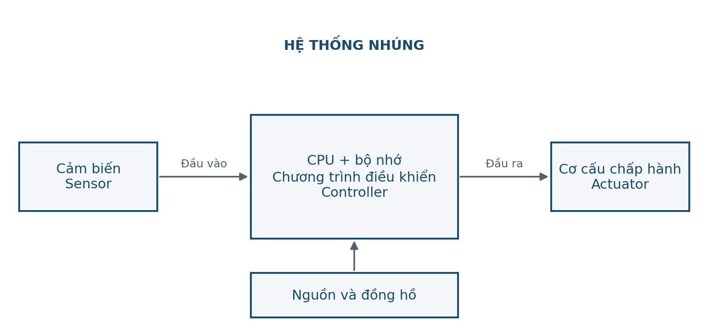
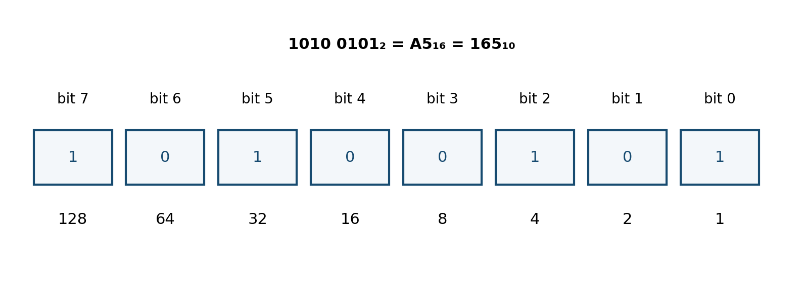
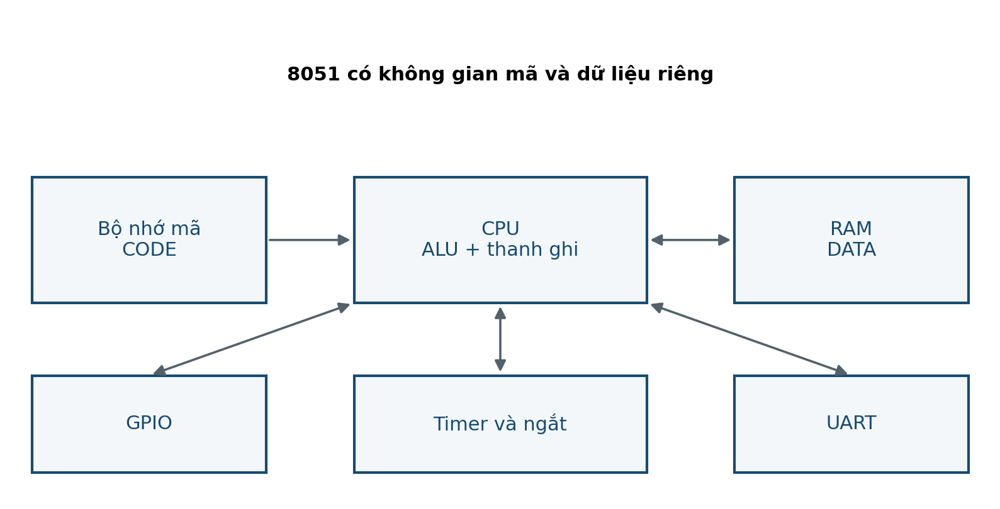

# BUỔI 01 — Hệ thống nhúng, hệ đếm & CPU

**Đọc trước:** Giáo trình trang **4–7**

<div class="week-meta">
<div><small>Track</small><strong>Lý thuyết</strong></div>
<div><small>Platform</small><strong>8051 / AT89S52</strong></div>
<div><small>Workflow</small><strong>PRE → LEC → CALC → VERIFY</strong></div>
</div>

## Mục tiêu

- Phân biệt hệ thống nhúng với máy tính đa dụng.
- Mô tả chuỗi Sensor → CPU/Memory → Actuator.
- Chuyển đổi binary/hexadecimal và hiểu cùng mẫu bit có nhiều cách diễn giải.
- Giải thích vai trò ALU, PC, thanh ghi, stack và không gian CODE/DATA.

=== "PRE · Đọc trước"

    1. Đọc trang **4–7**.
    2. Gạch chân thanh ghi / khái niệm mới.
    3. Tự làm ví dụ trước khi xem kết quả.
    4. Viết **01 câu hỏi** mang đến lớp.

=== "LEC · Nội dung cốt lõi"

    ### 1. Hệ thống nhúng và yêu cầu thời gian
    Vi điều khiển đọc tín hiệu vào, xử lý theo quy tắc và tạo tín hiệu ra. Một kết quả tính đúng nhưng xuất quá muộn vẫn có thể là **sai hệ thống**.

    ### 2. Hệ đếm
    Một byte có 8 bit. Hexadecimal gom 4 bit thành một chữ số, rất phù hợp khi đọc thanh ghi.

    Ví dụ:
    - `173 = 1010 1101₂ = 0xAD`.
    - `0x31` có thể là số 49, ASCII `'1'` hoặc tám tín hiệu độc lập.

    ### 3. Signed data
    Bù hai 8 bit biểu diễn từ −128 đến 127. Mẫu `0xFB` có thể là 251 không dấu hoặc −5 có dấu.

    ### 4. CPU
    8051 có A, B, DPTR, PSW, PC; chương trình nằm trong CODE, biến thay đổi nằm trong DATA/RAM.

    <figure class="hct-figure">
      <a href="../../../../../assets/images/microcontroller/theory/fig01-embedded-system.png" target="_blank" rel="noopener">
        
      </a>
      <figcaption>Hình 1. Hệ thống điều khiển gồm cảm biến, bộ xử lý và cơ cấu chấp hành.</figcaption>
    </figure>

    <figure class="hct-figure">
      <a href="../../../../../assets/images/microcontroller/theory/fig02-bit-weights-a5.png" target="_blank" rel="noopener">
        
      </a>
      <figcaption>Hình 2. Trọng số của tám bit trong byte A5H.</figcaption>
    </figure>

    <figure class="hct-figure">
      <a href="../../../../../assets/images/microcontroller/theory/fig03-8051-functional-blocks.png" target="_blank" rel="noopener">
        
      </a>
      <figcaption>Hình 3. Các khối chức năng chính của kiến trúc 8051.</figcaption>
    </figure>

=== "ACT · Hoạt động trên lớp"

    **Bài toán:** Phân tích bộ đếm người ra/vào: input, output, thời gian đáp ứng, trạng thái lỗi.

    Yêu cầu: ghi rõ giả thiết, đơn vị, sơ đồ/timeline và cách kiểm chứng.

=== "SELF-CHECK"

    1. Vì sao LED sáng đúng nhưng chậm 3 s có thể vẫn là kết quả sai?
    2. Khác nhau giữa `7`, `'7'` và chuỗi ký tự `"7"`?
    3. PC khác biến đếm của người lập trình như thế nào?

=== "AFTER · Sau lớp"

    - Hoàn thành engineering note ngắn.
    - Ghi điều đã hiểu, phép tính đã làm và câu hỏi còn vướng.
    - Nếu có mô phỏng, lưu ảnh có nhãn và đơn vị.
    - Không dùng số dự kiến thay số đo.


## Code minh họa

<div class="hct-code-actions">

[💻 Xem project trên GitHub](https://github.com/Huynhcongtu/hct-learning-hub/tree/main/code/theory/W01_Bit_Data_CPU){ .md-button .md-button--primary }
[⬇️ Mở main.c](https://raw.githubusercontent.com/Huynhcongtu/hct-learning-hub/main/code/theory/W01_Bit_Data_CPU/main.c){ .md-button }

</div>

```c
#include "common.h"

/* Supplemental example: bit masking and data interpretation. */
static u8 set_bit1_clear_bit6(u8 x) {
    x &= (u8)~0x40u;
    x |= 0x02u;
    return x;
}

void main(void) {
    u8 x = 0xCDu;
    u8 y = set_bit1_clear_bit6(x);

    /* Put values on ports so they can be inspected in simulator. */
    P1 = x;
    P2 = y;

    for (;;) { }
}
```

!!! info
    Code ở mục này là **SUPPLEMENTAL**: ví dụ bổ sung theo nội dung buổi học,
    không phải đoạn mã nguyên văn của giáo trình.

## Checklist

- [ ] Đọc phần được giao
- [ ] Làm phép tính / self-check
- [ ] Có ít nhất một câu hỏi
- [ ] Hoàn thành hoạt động
- [ ] Lưu bằng chứng
