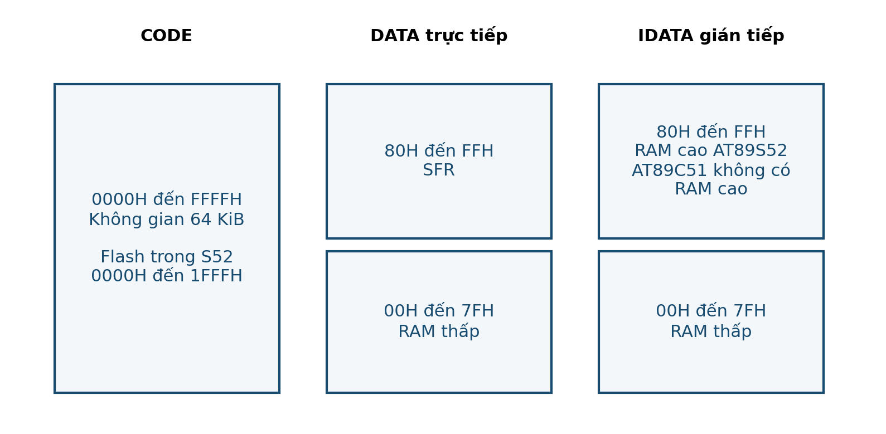

# BUỔI 03 — RAM, clock & định địa chỉ

**Đọc trước:** Giáo trình trang **11–13**

<div class="week-meta">
<div><small>Track</small><strong>Lý thuyết</strong></div>
<div><small>Platform</small><strong>8051 / AT89S52</strong></div>
<div><small>Workflow</small><strong>PRE → LEC → CALC → VERIFY</strong></div>
</div>

## Mục tiêu

- Mô tả RAM thấp, register banks, bit-addressable RAM, stack và SFR.
- Tính thời gian từ clock 11.0592 MHz, lõi 12T.
- Phân biệt immediate, direct, indirect, register và indexed addressing.
- Đọc bảng mã từ CODE.

=== "PRE · Đọc trước"

    1. Đọc trang **11–13**.
    2. Gạch chân thanh ghi / khái niệm mới.
    3. Tự làm ví dụ trước khi xem kết quả.
    4. Viết **01 câu hỏi** mang đến lớp.

=== "LEC · Nội dung cốt lõi"

    ### RAM và stack
    RAM thấp gồm register banks, vùng bit-addressable và vùng dữ liệu. Stack tăng về phía địa chỉ cao; stack bị ghi đè có thể làm chương trình quay về sai địa chỉ.

    ### Chu kỳ máy
    Với cấu hình 12T:

    ```text
    f_machine = 11.0592 MHz / 12 = 921.6 kHz
    T_machine ≈ 1.085 µs
    ```

    Không được đồng nhất “một lệnh” với “một chu kỳ máy”; phải đọc timing của lệnh.

    ### Định địa chỉ
    - Immediate: hằng nằm ngay trong lệnh.
    - Direct: địa chỉ được ghi rõ.
    - Indirect: địa chỉ nằm trong R0/R1/DPTR tùy lệnh.
    - Indexed: thường dùng truy xuất bảng CODE.

    <figure class="hct-figure">
      <a href="../../../../../assets/images/microcontroller/theory/fig06-code-ram-sfr-map.png" target="_blank" rel="noopener">
        
      </a>
      <figcaption>Hình 6. Bản đồ CODE, RAM và SFR dùng để liên hệ cơ chế định địa chỉ.</figcaption>
    </figure>

=== "ACT · Hoạt động trên lớp"

    **Bài toán:** Lập bảng phân biệt địa chỉ, nội dung địa chỉ và hằng số cho 5 câu lệnh mẫu.

    Yêu cầu: ghi rõ giả thiết, đơn vị, sơ đồ/timeline và cách kiểm chứng.

=== "SELF-CHECK"

    1. Stack tăng theo hướng nào?
    2. Một delay mô phỏng sai clock sẽ sai điều gì?
    3. MOVC phù hợp với dữ liệu loại nào?

=== "AFTER · Sau lớp"

    - Hoàn thành engineering note ngắn.
    - Ghi điều đã hiểu, phép tính đã làm và câu hỏi còn vướng.
    - Nếu có mô phỏng, lưu ảnh có nhãn và đơn vị.
    - Không dùng số dự kiến thay số đo.

## Checklist

- [ ] Đọc phần được giao
- [ ] Làm phép tính / self-check
- [ ] Có ít nhất một câu hỏi
- [ ] Hoàn thành hoạt động
- [ ] Lưu bằng chứng
