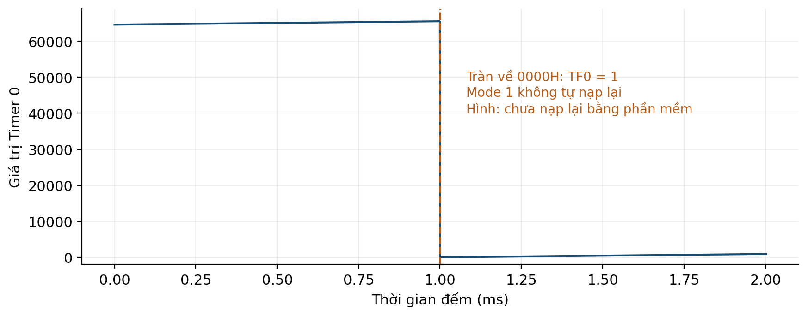

# BUỔI 07 — Tính Timer & baud rate

**Đọc trước:** Giáo trình trang **25–26, 32**

<div class="week-meta">
<div><small>Track</small><strong>Lý thuyết</strong></div>
<div><small>Platform</small><strong>8051 / AT89S52</strong></div>
<div><small>Workflow</small><strong>PRE → LEC → CALC → VERIFY</strong></div>
</div>

## Mục tiêu

- Tính số count và reload từ yêu cầu thời gian.
- Tính TH1 cho UART.
- Ước lượng thời gian truyền chuỗi.
- Đánh giá sai số do lượng tử thời gian và phần mềm.

=== "PRE · Đọc trước"

    1. Đọc trang **25–26, 32**.
    2. Gạch chân thanh ghi / khái niệm mới.
    3. Tự làm ví dụ trước khi xem kết quả.
    4. Viết **01 câu hỏi** mang đến lớp.

=== "LEC · Nội dung cốt lõi"

    ### Timer 0 mode 1
    Với `T_machine ≈ 1.085 µs`:

    ```text
    N ≈ T_required / T_machine
    Reload = 65536 - N
    ```

    Ví dụ 1 ms cần xấp xỉ 922 count, reload gần `0xFC66`.

    ### UART 9600
    Với 11.0592 MHz, Timer 1 mode 2 và cấu hình chuẩn, `TH1 = 0xFD` là mốc cho 9600 baud.

    ### Thời gian frame
    8N1 dùng khoảng 10 bit cho mỗi byte. Ở 9600 baud:

    ```text
    T_byte ≈ 10 / 9600 ≈ 1.042 ms
    ```

    <figure class="hct-figure">
      <a href="../../../../../assets/images/microcontroller/theory/fig10-timer-fc66-overflow.png" target="_blank" rel="noopener">
        
      </a>
      <figcaption>Hình 10. Ví dụ trực quan cho bài toán reload Timer.</figcaption>
    </figure>

    <figure class="hct-figure">
      <a href="../../../../../assets/images/microcontroller/theory/fig12-uart-8n1-a5.png" target="_blank" rel="noopener">
        
      </a>
      <figcaption>Hình 12. Khung UART 8N1 hỗ trợ tính bit time và frame time.</figcaption>
    </figure>

=== "ACT · Hoạt động trên lớp"

    **Bài toán:** Tính reload cho 10 ms; tính thời gian tối thiểu truyền 48 byte 8N1; trình bày bước tính.

    Yêu cầu: ghi rõ giả thiết, đơn vị, sơ đồ/timeline và cách kiểm chứng.

=== "SELF-CHECK"

    1. Vì sao số đo ISR có thể dài hơn thời gian phần cứng tính từ reload?
    2. Nếu clock đổi, TH1 có được giữ nguyên không?
    3. 20 byte ở 9600 baud mất tối thiểu khoảng bao lâu?

=== "AFTER · Sau lớp"

    - Hoàn thành engineering note ngắn.
    - Ghi điều đã hiểu, phép tính đã làm và câu hỏi còn vướng.
    - Nếu có mô phỏng, lưu ảnh có nhãn và đơn vị.
    - Không dùng số dự kiến thay số đo.

## Checklist

- [ ] Đọc phần được giao
- [ ] Làm phép tính / self-check
- [ ] Có ít nhất một câu hỏi
- [ ] Hoàn thành hoạt động
- [ ] Lưu bằng chứng
