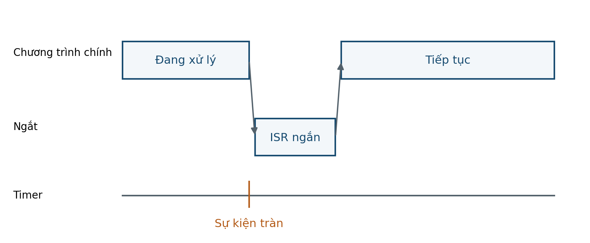

# BUỔI 08 — Ngắt & lập lịch không chặn

**Đọc trước:** Giáo trình trang **28–30**

<small>Track</small><strong>Lý thuyết</strong>

<small>Platform</small><strong>8051 / AT89S52</strong>

<small>Workflow</small><strong>PRE → LEC → CALC → VERIFY</strong>

## Mục tiêu

- Giải thích vector, enable và priority.
- Viết ISR ngắn và có trách nhiệm rõ.
- Dùng tick để lập lịch cộng tác.
- Thay delay dài bằng tác vụ không chặn.

=== "PRE · Đọc trước"

    1. Đọc trang **28–30**.
    2. Gạch chân thanh ghi / khái niệm mới.
    3. Tự làm ví dụ trước khi xem kết quả.
    4. Viết **01 câu hỏi** mang đến lớp.

=== "LEC · Nội dung cốt lõi"

    ### Interrupt
    Ngắt tạm dừng luồng chính, chạy ISR rồi quay lại. ISR nên ngắn, tránh công việc kéo dài làm mất sự kiện khác.

    ### Cooperative scheduling
    Một tick định kỳ có thể tạo các cờ `task_due`. Main loop thực hiện mỗi tác vụ một phần nhỏ rồi trả quyền điều khiển.

    ### Wrap-around
    So sánh thời gian cần an toàn khi bộ đếm tick tràn; tránh logic chỉ đúng trước lần tràn đầu tiên.

    <figure class="hct-figure">
      
      <figcaption>Hình 11. CPU phục vụ ISR rồi quay lại chương trình chính.</figcaption>
    </figure>

=== "ACT · Hoạt động trên lớp"

    **Bài toán:** Chuyển chương trình dùng delay 1 s thành scheduler tick + state machine.

    Yêu cầu: ghi rõ giả thiết, đơn vị, sơ đồ/timeline và cách kiểm chứng.

=== "SELF-CHECK"

    1. Tại sao không nên cập nhật LCD dài trong ISR timer?
    2. Main loop không chặn mang lại lợi ích gì cho UART?
    3. Tick tràn có thể làm scheduler sai thế nào?

=== "AFTER · Sau lớp"

    - Hoàn thành engineering note ngắn.
    - Ghi điều đã hiểu, phép tính đã làm và câu hỏi còn vướng.
    - Nếu có mô phỏng, lưu ảnh có nhãn và đơn vị.
    - Không dùng số dự kiến thay số đo.

## Checklist

- [ ] Đọc phần được giao
- [ ] Làm phép tính / self-check
- [ ] Có ít nhất một câu hỏi
- [ ] Hoàn thành hoạt động
- [ ] Lưu bằng chứng
