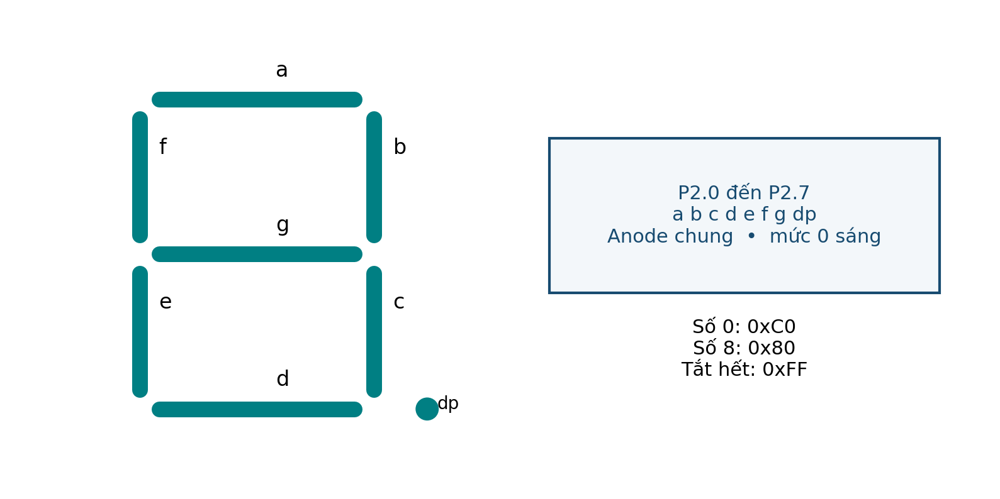

# BUỔI 10 — Nguồn, bus & LED 7 đoạn

**Đọc trước:** Giáo trình trang **21, 34–35, 52–53**

<div class="week-meta">
<div><small>Track</small><strong>Lý thuyết</strong></div>
<div><small>Platform</small><strong>8051 / AT89S52</strong></div>
<div><small>Workflow</small><strong>PRE → LEC → CALC → VERIFY</strong></div>
</div>

## Mục tiêu

- Thiết kế LED theo cực tính và giới hạn dòng.
- Tạo bảng mã 7 đoạn.
- Giải thích multiplexing và ghosting.
- Nhận biết xung đột tài nguyên/chân khi mở rộng hệ thống.

=== "PRE · Đọc trước"

    1. Đọc trang **21, 34–35, 52–53**.
    2. Gạch chân thanh ghi / khái niệm mới.
    3. Tự làm ví dụ trước khi xem kết quả.
    4. Viết **01 câu hỏi** mang đến lớp.

=== "LEC · Nội dung cốt lõi"

    ### LED 7 đoạn
    Bảy segment a–g tạo chữ số. Mã hiển thị phụ thuộc common-anode/common-cathode và ánh xạ bit.

    ### Multiplex
    Bốn digit dùng chung bus segment. Trình tự an toàn:

    ```text
    tắt tất cả digit
    → đổi segment
    → bật digit mới
    ```

    Làm ngược dễ gây **ghosting**.

    ### Tài nguyên
    Không chỉ kiểm tra “trùng chân”; còn phải kiểm tra trùng Timer, bus, ISR và giới hạn dòng.

    <figure class="hct-figure">
      <a href="../../../../../assets/images/microcontroller/theory/fig13-seven-segment-map.png" target="_blank" rel="noopener">
        
      </a>
      <figcaption>Hình 13. Tên các đoạn và bảng mã anode chung của cấu hình mẫu.</figcaption>
    </figure>

    <figure class="hct-figure">
      <a href="../../../../../assets/images/microcontroller/theory/fig14-four-digit-multiplex.png" target="_blank" rel="noopener">
        
      </a>
      <figcaption>Hình 14. Quét bốn digit và dành khoảng tắt khi thay mã đoạn.</figcaption>
    </figure>

=== "ACT · Hoạt động trên lớp"

    **Bài toán:** Từ sơ đồ common-anode, xây bảng mã 0–9 và giải thích mẫu cho 0, 1, 8.

    Yêu cầu: ghi rõ giả thiết, đơn vị, sơ đồ/timeline và cách kiểm chứng.

=== "SELF-CHECK"

    1. Vì sao phải tắt digit cũ trước khi đổi segment?
    2. Duty mỗi digit ảnh hưởng độ sáng thế nào?
    3. Không trùng pin có chắc không trùng tài nguyên?

=== "AFTER · Sau lớp"

    - Hoàn thành engineering note ngắn.
    - Ghi điều đã hiểu, phép tính đã làm và câu hỏi còn vướng.
    - Nếu có mô phỏng, lưu ảnh có nhãn và đơn vị.
    - Không dùng số dự kiến thay số đo.


## Code minh họa

<div class="hct-code-actions">

[💻 Xem project trên GitHub](https://github.com/Huynhcongtu/hct-learning-hub/tree/main/code/theory/W10_SevenSegment_Table){ .md-button .md-button--primary }
[⬇️ Mở main.c](https://raw.githubusercontent.com/Huynhcongtu/hct-learning-hub/main/code/theory/W10_SevenSegment_Table/main.c){ .md-button }

</div>

```c
#include "common.h"

u8 ROM seg_ca[10]={
    0xC0,0xF9,0xA4,0xB0,0x99,
    0x92,0x82,0xF8,0x80,0x90
};

void main(void) {
    u8 digit=0;

    P1=0xFF;
    for (;;) {
        P2=seg_ca[digit];
        digit++;
        if(digit==10u) digit=0;
    }
}
```

!!! info
    Code ở mục này là **SUPPLEMENTAL**: ví dụ bổ sung theo nội dung buổi học,
    không phải đoạn mã nguyên văn của giáo trình.

## Checklist

- [ ] Đọc phần được giao
- [ ] Làm phép tính / self-check
- [ ] Có ít nhất một câu hỏi
- [ ] Hoàn thành hoạt động
- [ ] Lưu bằng chứng
